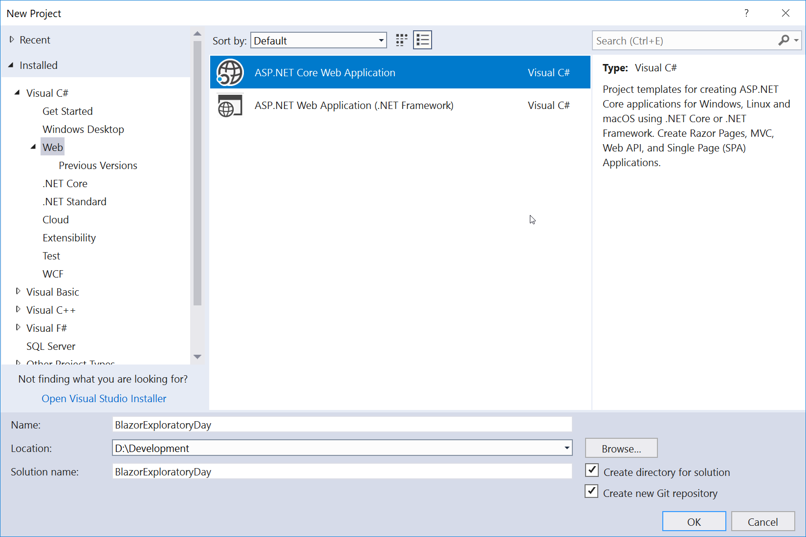
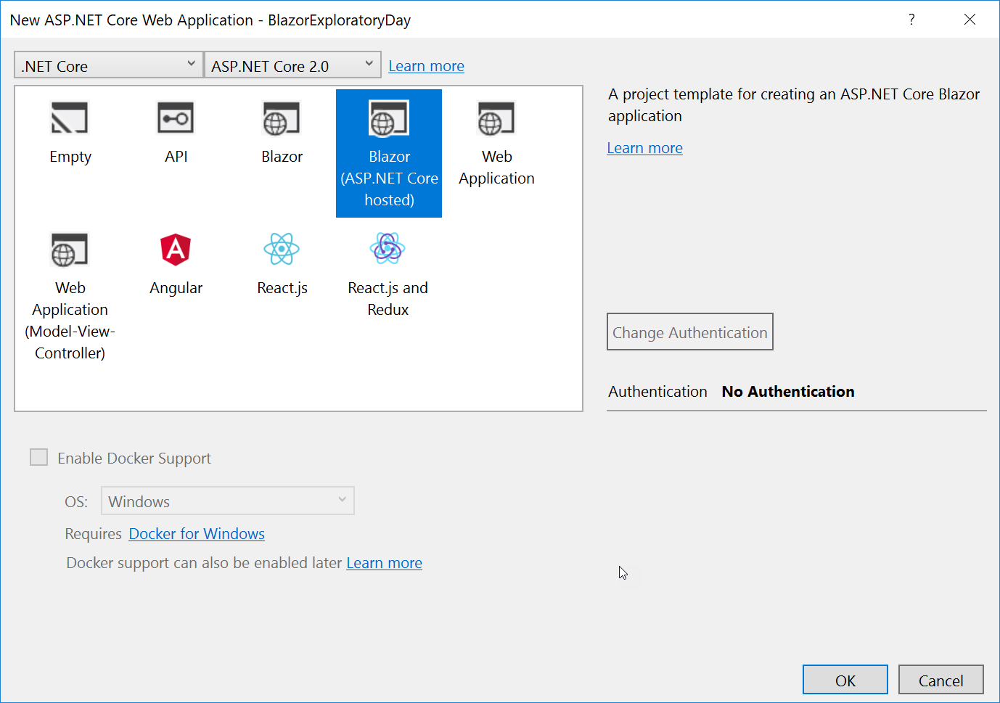
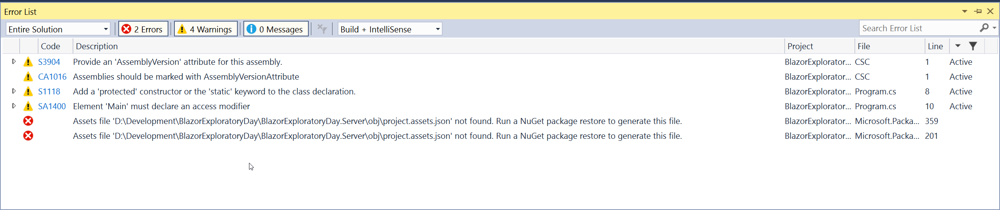
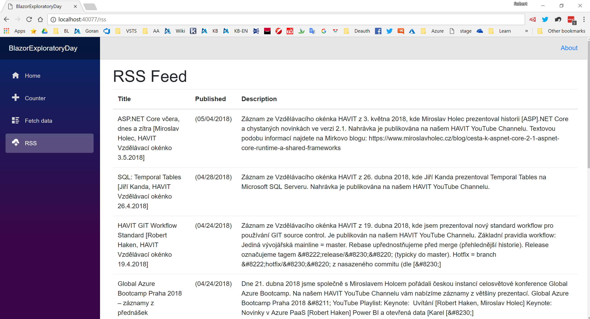

# Blazor Exploratory Day

## Install Blazor
* **Get Started: https://blazor.net/docs/get-started.html**
	1. Install the [.NET Core 2.1 SDK](https://go.microsoft.com/fwlink/?linkid=873092)(2.1.300-preview2-008533 or later).
	1. Install Visual Studio 2017 (15.7 Preview 5 or later) with the ASP.NET and web development workload selected.
	1. Install the latest [Blazor Language Services extension](https://go.microsoft.com/fwlink/?linkid=870389) from the Visual Studio Marketplace.

## New project from template
1. File - New Project - ASP.NET Core Web Application
	
2. Blazor (ASP.NET Core hosted) - ASP.NET Core 2.0+
	
3. Build + Run

### Troubleshooting
1. Unable to build the new project from template?

Open Command Prompt and run `dotnet restore`.

## Recommended Approach
1. Follow **Build Your First App** tutorial: https://blazor.net/docs/tutorials/build-your-first-blazor-app.html
2. Study https://blazor.net/docs/index.html and play!

## Implementation Tip 1 - RSS Visualization
Add new page which visualises RSS feed contents (e.g. https://knowledge-base.havit.cz/feed/)

1. Option 1: Download the RSS on server-side and expose the data through WebAPI to Blazor front-end.
2. Option 2: Donwload the RSS from Blazer directly (without involvement of the server).

## Implementation Tip 2 - Simple TODO list
with in-memory "persistence" on server-side.

